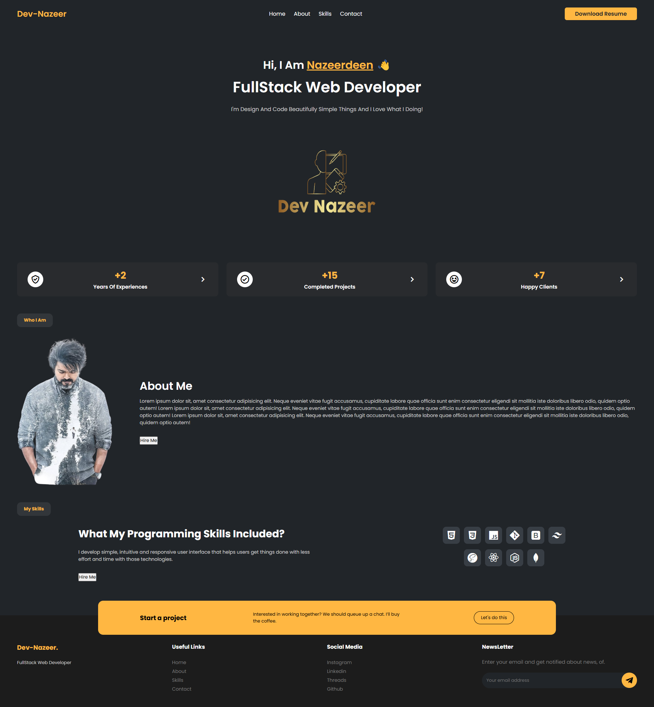

# Personal Portfolio Design
In this project, I'm going to show you how to use modern HTML and CSS to create a completely responsive Portfolio Design with awesome color theme. I have been using CSS Flexbox, Media queries for our responsive design and CSS  transition for some cool animation effects. Also I have a great footer for it! This project contains Navbar, Main section, Guarantee section, About section, Skills section and an awesome Footer!

# Screenshot
Here I have project screenshot :

